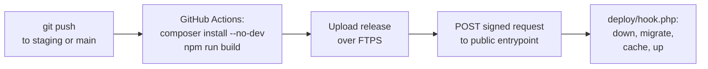

# Deploy mechanism — how a `git push` reaches the server

No SSH is available on the cPanel host, so this can't `git pull` or run
`composer`/`artisan` on the server directly. Instead:



1. **Build** happens on GitHub's runner, not on the server: `composer install
   --no-dev` and `npm run build` produce `vendor/` and compiled assets, since
   the cPanel host can't run either.
2. **Upload** happens over FTPS to a folder outside the subdomain's document
   root (see the setup guide's folder layout) — everything except `.env`,
   `storage/app`, `storage/framework/{cache,sessions,views}`,
   `storage/logs`, and the deploy hook's own config file, which are
   server-only state that must never be overwritten by a deploy.
3. **Post-deploy commands** run through `deploy/hook.php`, called over HTTPS
   by the workflow. It bootstraps Laravel in-process and calls `Artisan::call()`
   directly — no shell needed — for: `down` (with a bypass secret) →
   `migrate --force` → `config:cache` → `route:cache` → `view:cache` →
   `event:cache` → `storage:link` (if missing) → `queue:restart` → `up`
   (always, even on failure, via a `finally` block).

## The two-file split, and why

- `deploy/hook.php` — the real engine. Lives outside `public/`, so it is
  **not** reachable over HTTP on its own.
- `public/dh-<random>.php` (you create this, see `public-entrypoint.example.php`)
  — a two-line file that just `require`s `deploy/hook.php`. This is the only
  part actually exposed to the internet, and its name is chosen once by hand
  per server and never checked into git — so redeploying the app never
  regenerates a predictable URL for it.
- `deploy/deploy-hook.config.php` — the per-server secret and path config,
  also created once by hand, also never committed (see `.gitignore`).

Even if someone finds the entrypoint's URL, every request must carry a valid
HMAC-SHA256 signature (`X-Deploy-Signature: sha256=...`) over
`<timestamp>.<raw body>`, keyed with a 32-byte random secret, plus a
timestamp within 5 minutes of the server's clock (`X-Deploy-Timestamp`) — so
a captured request can't be replayed later. Both checks are enforced before
anything else runs. See `.github/scripts/call-deploy-hook.sh` for how the
workflow signs its request.

## The scheduler (cron)

cPanel's **Cron Jobs** feature runs independently of SSH — it's a standard
part of cPanel, not a shell login. Add one cron entry per environment,
pointed at that environment's `artisan` file:

```
* * * * * php /home/USERNAME/staging_app/artisan schedule:run >> /dev/null 2>&1
* * * * * php /home/USERNAME/live_app/artisan schedule:run >> /dev/null 2>&1
```

This is what fires the two show reminders (15-day, 7-day), subscription
renewal reminders, and any other scheduled job in `routes/console.php`. Set
this up once per environment in cPanel's Cron Jobs screen — the setup guide
covers where.

## Rolling back

FTP-Deploy-Action only adds/updates files (`dangerous-clean-slate: false`),
it never deletes on its own, so the fastest rollback is: `git revert` the bad
commit (or push the previous good commit's SHA to the branch again) and let
the workflow redeploy it. Because migrations only ever run forward here,
a rollback that depends on reversing a migration needs a manual
`php artisan migrate:rollback`-equivalent — run it by triggering the hook
directly with `{"migrate": false}` after manually restoring the schema, or
temporarily add a one-off command; this is also covered in the setup guide.
